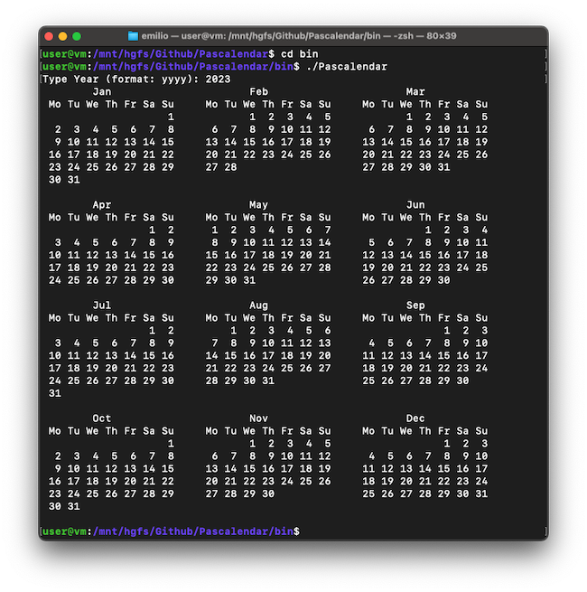

# Pascalendar

Pascalendar is a small command line program written in Pascal ISO 10206 (Extended Pascal) that prints on the terminal the calendar of one year chosen by the user.

The program will print a careful visual representation with headers for each month and day of the week.

## How to use it
Compile using:

	$ make all

Then execute:

	$ bin/Pascalendar

## Compilation
Uses GNU Pascal compiler:

	$ make all

Clean files:

	$ make clean

